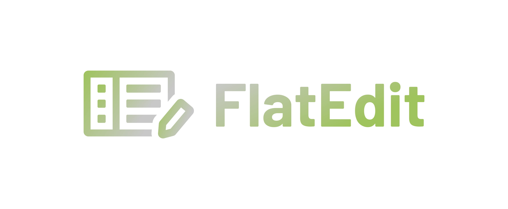

# logo.flatedit.com

## Font

Font in use <a target="_blank" href="https://fonts.google.com/specimen/Barlow">Barlow-Bold</a> designed by
<a target="_blank" href="https://tribby.com/">Jeremy Tribby</a>
and licensed under
<a target="_blank" href="http://scripts.sil.org/cms/scripts/page.php?site_id=nrsi&amp;id=OFL_web">Open Font License.</a>
Icon Designed by
<a target="_blank" href="https://thenounproject.com/coquet_adrien">Adrien Coquet</a>

## Colors

Background

      transparent

Font
    
    #C8C8C8, #9FC35D

Icon

    #9FC35D, #C8C8C8
    
    
    

## 1

## 2

## 3

## 4

---

+ [edit](https://github.com/flatedit/logo/edit/main/README.md)
+ [flatedit/logo/](https://github.com/flatedit/logo/)

